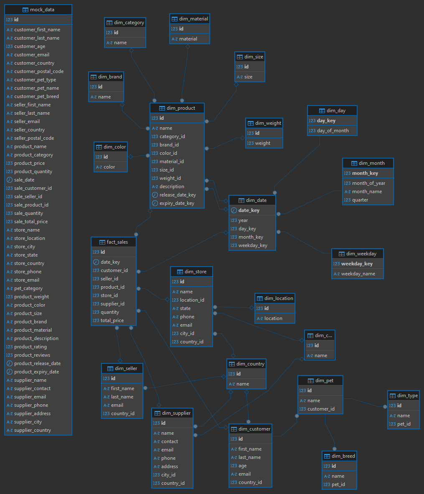

# Лабораторная работа №1

Работу выполнил: Сарайкин Н.С. М8О-306Б-22

Скрипты `DDL`, `DML` лежат в папке `init`. Там же лежит `initial_data` в виде 10 csv файлов. В папке `pg-docker` лежит файл инициализации `docker-compose.yaml`. В корне есть файл `analyze.sql`, с помощью запросов которого были исследованы данные перед построением модели "Снежинка". С помощью `dbeaver` получилось наглядно визуализировать результат. `mock_data.csv` - полный датасет, собранный из всех данных csv файлов. 

## Как запустить? 

```shell
cd pg-docker
```
Создать файл `.env` и указать данные для `PostgreSQL`.

```shell
docker compose up -d
```

